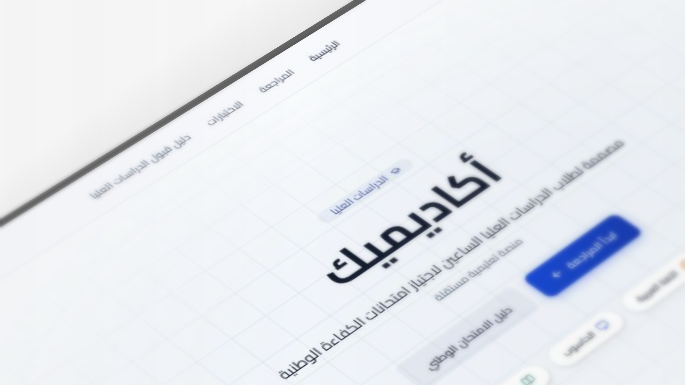

# Academiq — أكاديميك

A free educational platform helping Iraqi graduate students pass national competency exams in Arabic, English, and Computer Science.



🌐 **Live:** [academiq-edu](https://academiq-edu.vercel.app/)

---

## Features

- **3 Subject tracks** — Arabic, English, and Computer Science
- **100+ structured lesson topics** with key points and reading references
- **Randomized practice quizzes** that simulate the national exam
- **Admissions guide** — step-by-step walkthrough of the postgraduate application process
- **RTL-first UI** with dark/light mode support
- **PWA-ready** — installable and optimized for mobile

## Tech Stack

| Layer | Technology |
|---|---|
| Framework | Next.js 16 (App Router) |
| Language | TypeScript |
| Styling | Tailwind CSS v4 + CSS custom properties |
| UI Components | shadcn/ui + Radix UI |
| Fonts | Cairo (Arabic), Geist (Latin) |
| Deployment | Vercel |


## Project Structure

```
src/
├── app/          # Routes and pages (Next.js App Router)
├── components/   # UI components
├── data/         # Lesson content and quiz questions
├── hooks/        # Custom React hooks
├── lib/          # Utility functions
└── types/        # TypeScript type definitions
```

## License

All rights reserved © 2026 Mohamed Hussein.
This source code is proprietary. You may view the code, but you are not permitted to copy, modify, distribute, sublicense, or claim ownership of any part of this work without explicit written permission from the author.
